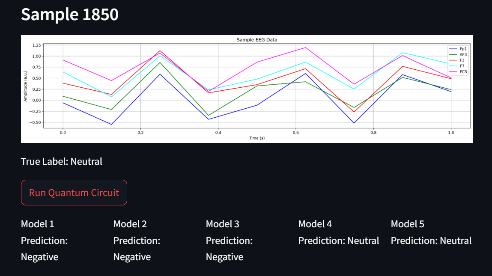
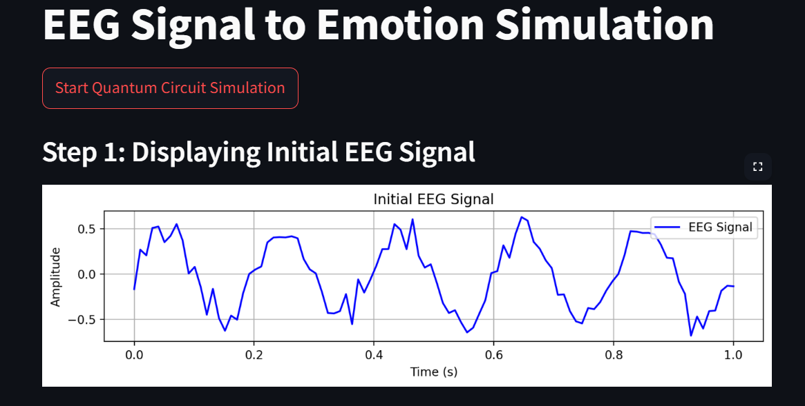
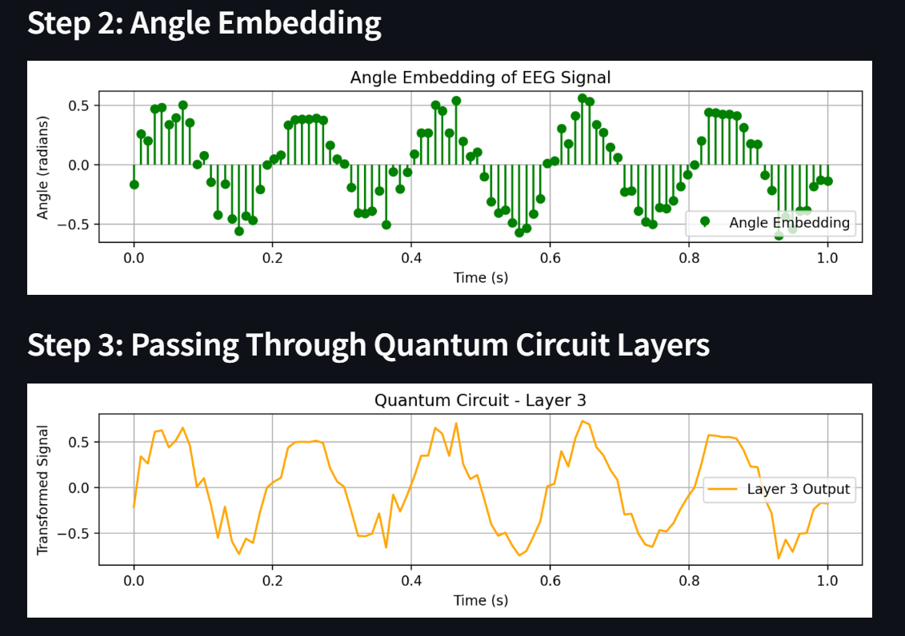

# EEG-Based Emotion Recognition Using Quantum Machine Learning

This repository contains the implementation of a hybrid quantum-classical framework for emotion recognition using EEG data. The project leverages quantum machine learning techniques to enhance feature extraction and classification tasks associated with EEG signals.

## Project Overview

The aim of this project is to explore the potential of Quantum Neural Networks (QNNs) in processing EEG data to recognize human emotions. This approach is expected to tap into the quantum advantages of processing information, potentially leading to more accurate and efficient emotion recognition systems.

## Results
Our research was aimed at identifying if better approaches existed, specifically quantum approaches to extract features from EEGs and identify the emotions they portray, and we managed to do this with an 73% accuracy on DEAP and 45.79% on SEED.
Below is how this work could be visualized and applied.

### Rendered Ideal Results



### Process Visualization
Step 1: Taking EEG signal as input


Step 2: Embedding and Quantum Layers


Step 3: Get output an Emotion


### Features

- **Quantum Feature Extraction**: Utilizes quantum circuits as feature extractors to process EEG data.
- **Hybrid Model Architecture**: Integrates quantum layers with classical neural network models for emotion classification.
- **Dataset**: Employs publicly available EEG datasets (SEED and Kaggle) tailored to emotion recognition tasks.

## Installation

To set up a local development environment, follow these steps:

```bash
# Clone the repository
git clone https://github.com/Tahiralira/EEG-Based-Emotion-Recognition-Using-Quantum-Machine-Learning.git
```

```bash
# Now Enter the Directory
cd EEG-Based-Emotion-Recognition-Using-Quantum-Machine-Learning
```

```bash
# Install required libraries
pip install -r requirements.txt
```

## Usage
To run the emotion recognition training scripts, execute the following command
For SEED Implementation:
```bash
Ctrl + Enter on each cell of newqnn.ipynb
```
For Kaggle DEAP Implementation:
```bash
Ctrl + Enter on each cell of QC_kaggle.ipynb
```
## Testing
To test the saved .pth models that we trained or that you train from the above scripts
In the Main Project directory
```bash
pip install -r requirements.txt
```
Open terminal
```bash
Cntrl + `
```
Run this script
```bash
python run_models.py
```

## Structure
- `Kaggle/`: Includes the Python scripts for the quantum and classical models implemented with Kaggle.

## Data
- `SEED`: The Dataset of SEED is restricted under EULA guidelines from being publically shared but you may request access from https://bcmi.sjtu.edu.cn/home/seed/seed.html
- `DEAP`: The secondary dataset was obtained from the kaggle project referenced in the report [3].

## Contributing

Contributions are welcome, and any contributions you make are **greatly appreciated**.

1. Fork the Project
2. Create your Feature Branch (`git checkout -b feature/AmazingFeature`)
3. Commit your Changes (`git commit -m 'Add some AmazingFeature'`)
4. Push to the Branch (`git push origin feature/AmazingFeature`)
5. Open a Pull Request

## License

Distributed under the Aheed Umer Bilal License. See `LICENSE` for more information.

## Contact

Aheed, Umer, Bilal - k214517@nu.edu.pk

Project Link: [https://github.com/Tahiralira/EEG-Based-Emotion-Recognition-Using-Quantum-Machine-Learning](https://github.com/Tahiralira/EEG-Based-Emotion-Recognition-Using-Quantum-Machine-Learning)

